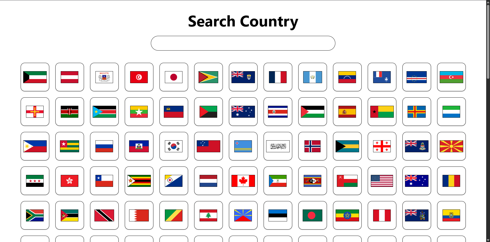
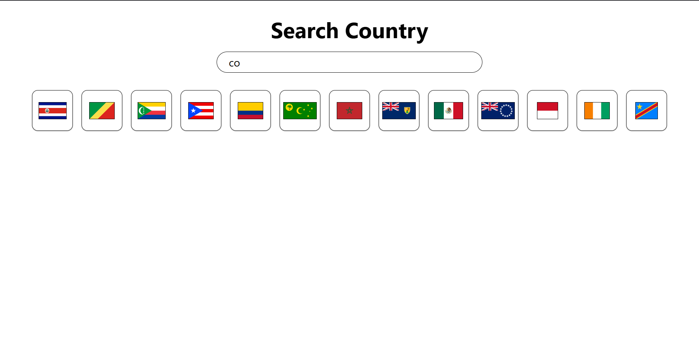
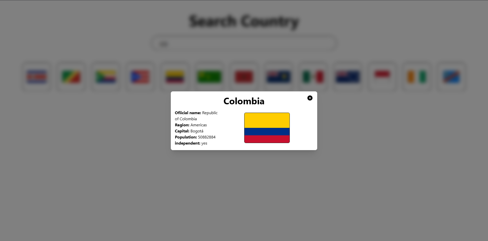

# Countries info

App for search basic information about countries.

This app use [University of Helsinki's Rest Countries API](https://studies.cs.helsinki.fi/restcountries). Build with React, Vite and Tailwindcss.

## App

## App search

## Country information
